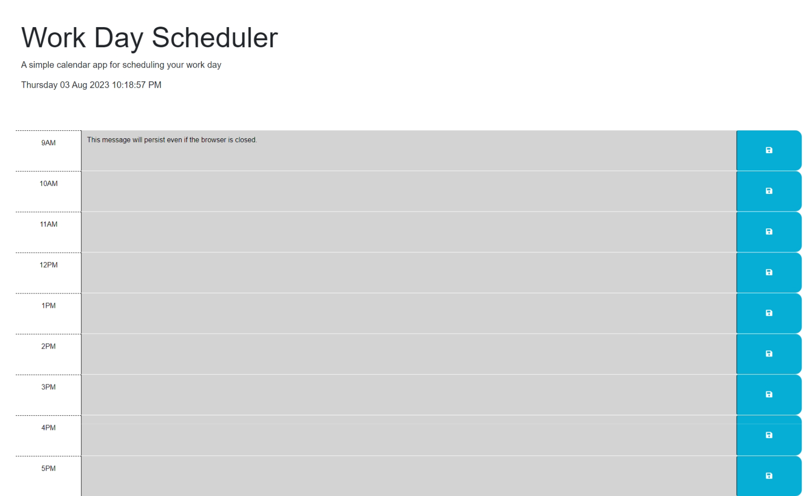

# Work Day Planner
Created a simple calender application able to run in the browser.
The application allows the user to save events for a 8 hour work day from 9am to 5pm. The user can add events to each hour of the day and the inputted data will persist. It will persist even if the browser is closed and reopened or refreshed.
Day.js was used.
# Screenshot 

